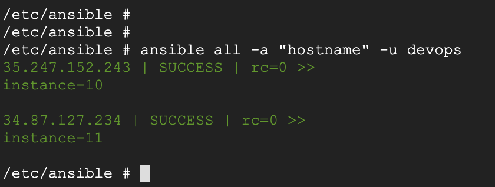
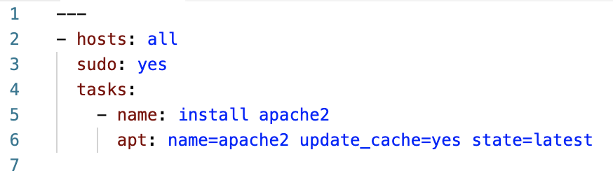

# Ansible Exercise

Getting started with Ansible – execute commands and run playbooks against a set of hosts. Minimal configuration required

### You Need

* A 'workstation' that has Docker running. This can be Google Cloud Shell, which is free to use, and it also has a browser-based editor!
* At least one virtual machine (in the cloud, probably) that runs Ubuntu. This exercise was tested with Ubuntu 18.04

## 1 – Your Ansible Shell

This is the place where you run ansible. Once more, do this in the Google Cloud Shell for example, but any Mac or Linux with Docker should be fine.

`git clone https://github.com/u1i/devops-course`

`cd devops-course/scripts`

`./run-ansible.sh`

This will create a directory 'ansible' in your $HOME directory. All files you create and edit should be in there.

## 2 – The Hosts

These are the machines we want to manipulate using Ansible. Provision one or two in the cloud and make sure they have Ubuntu 18.04 running.

In an SSH session do this:

`git clone https://github.com/u1i/devops-course`

`cd devops-course/scripts`

`./add-user.sh`

**WARNING: This one opens a 'backdoor' to your machine by installing SSH Keys. Do only use for test machines and delete them right after**

## 3 – Add the IP Addresses of the Hosts to Ansible

Back in your Ansible Shell create a file called 'hosts' (the absolute path of the file should be /etc/ansible/hosts) and add each IP address of the hosts into a new line

## 4 – Ping all Hosts from Ansible

The following command should now work:

`ansible all -m ping -u devops`

> 35.247.152.243 | SUCCESS => {
    "changed": false, 
    "ping": "pong"
}
34.87.127.234 | SUCCESS => {
    "changed": false, 
    "ping": "pong"
}

## 5 – Executing Commands on All Hosts

`ansible all -a "/bin/echo hello" -u devops`

`ansible all -a "hostname" -u devops`

## 6 – Install Apache with a Playbook

### Create the following file apache.yml on your Ansible Shell:

[apache.yml](./apache.yml)

### Run the playbook

`ansible-playbook apache.yaml -u devops`
